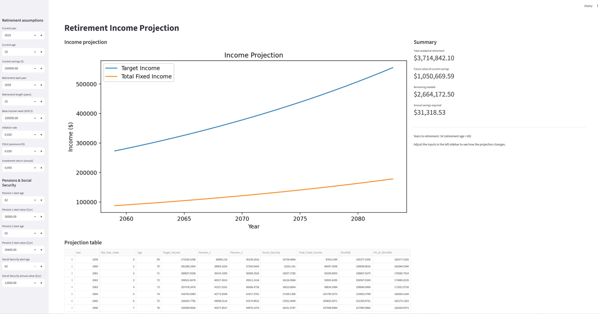

# Retirement Planner — Streamlit App

This small Streamlit app projects retirement income needs and fixed income sources (two pensions + Social Security) on an age-based timeline. It computes the year-by-year shortfall between your target retirement income (inflation-adjusted) and expected fixed income, the present value of that shortfall, and an estimate of how much you must save each year (end-of-year contributions) to meet the gap.

The app is intentionally lightweight and interactive: change assumptions in the left sidebar and the plot/table update immediately.

I created this tool for my own planning as I couldn't find an existing retirement planner that met my needs. Feel free to use and modify it as you see fit!

## What it does
- Projects Target Income over retirement years (inflation-adjusted)
- Projects Pension 1, Pension 2, and Social Security starting at user-specified ages and applying COLA
- Calculates the year-by-year shortfall and the present value (PV) of that shortfall
- Estimates the annual savings (end-of-year deposits) required between now and retirement to cover the PV shortfall after factoring in the future value of current savings
- Exports the full projection to `retirement_cash_flow.csv` when the underlying module is executed directly

## Files
- `retirement.py` — core computation. Call `compute_projection(...)` to get the projection DataFrame and summary metrics.
- `app.py` — Streamlit app (interactive UI & plots).
- `requirements.txt` — Python package dependencies used by the project.
- `retirement_cash_flow.csv` — output CSV (created when `retirement.py` is run directly).

## Requirements
- Python 3.8+ (a venv is recommended)
- Packages listed in `requirements.txt` (the primary ones are: pandas, numpy, matplotlib, seaborn, streamlit)

## Install
Open PowerShell and (optionally) create/activate a virtual environment, then install dependencies:

```powershell
# from project root (E:\retirementplanner)
python -m venv .venv
E:\retirementplanner\.venv\Scripts\Activate.ps1
pip install -r requirements.txt
```

If you already have a venv created by this workspace, activate it and run the install command above.

## Run the Streamlit app
Start the app from the project root:

```powershell
E:\retirementplanner\.venv\Scripts\Activate.ps1
E:\retirementplanner\.venv\Scripts\python.exe -m streamlit run e:\retirementplanner\app.py
```

Or, if the venv is active and `streamlit` is on your PATH, simply:

```powershell
streamlit run e:\retirementplanner\app.py
```

The app will open in your browser. Use the left sidebar to change inputs.

## Sidebar controls (what they do)
- Current year — the base year for inflation and age calculations.
- Current age — your age today (used to compute ages across projection years).
- Current savings ($) — your current investment/savings that can grow to retirement.
- Retirement start year — the first year of retirement cash flows.
- Retirement length (years) — how many years you expect retirement to last (affects the projection horizon).
- Base income need (2025 $) — the desired yearly income in today's dollars, which will be inflated into future years.
- Inflation, COLA, Investment return — rates used for inflating needs, indexing pensions/SS, and discounting/compounding.
- Pension 1 / Pension 2 start age and start value — specify the age each pension begins and its starting annual amount (COLA applied thereafter).
- Social Security start age and annual value — specify the age SS starts and its initial annual amount.


Generated on: 2025-11-03

## Example screenshot

Below is an example screenshot of the app. 




